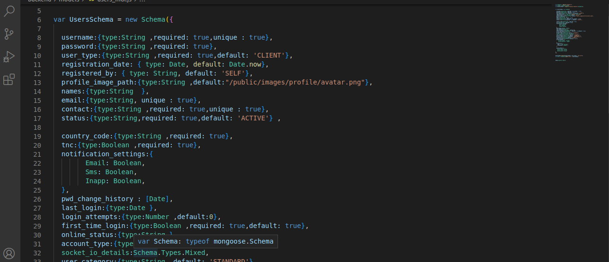
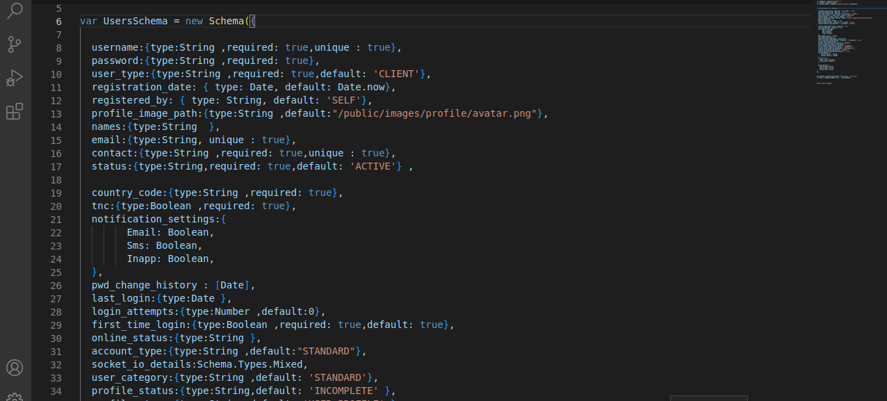
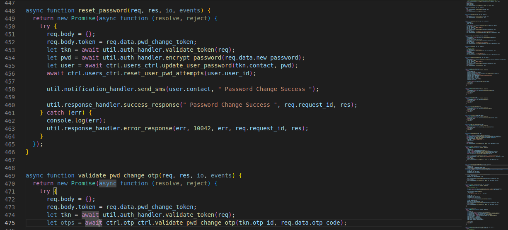
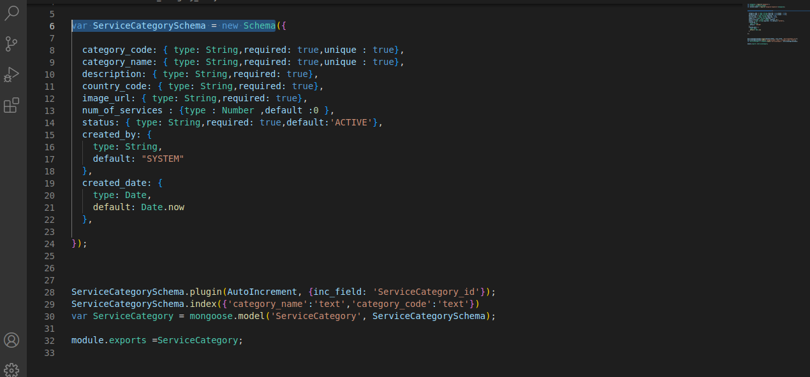
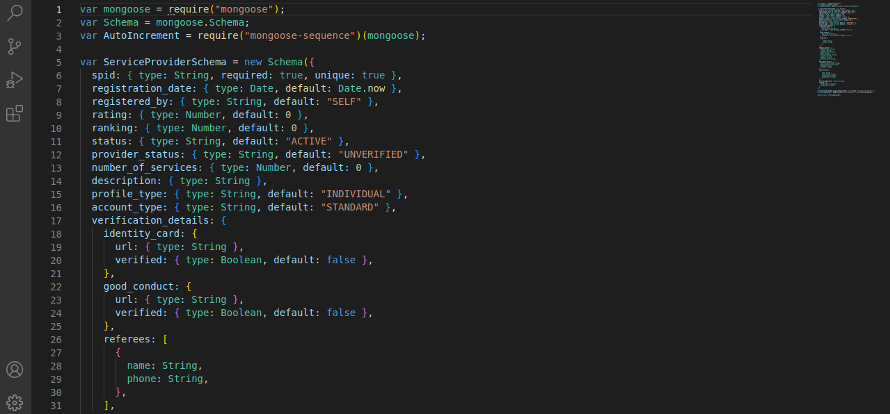
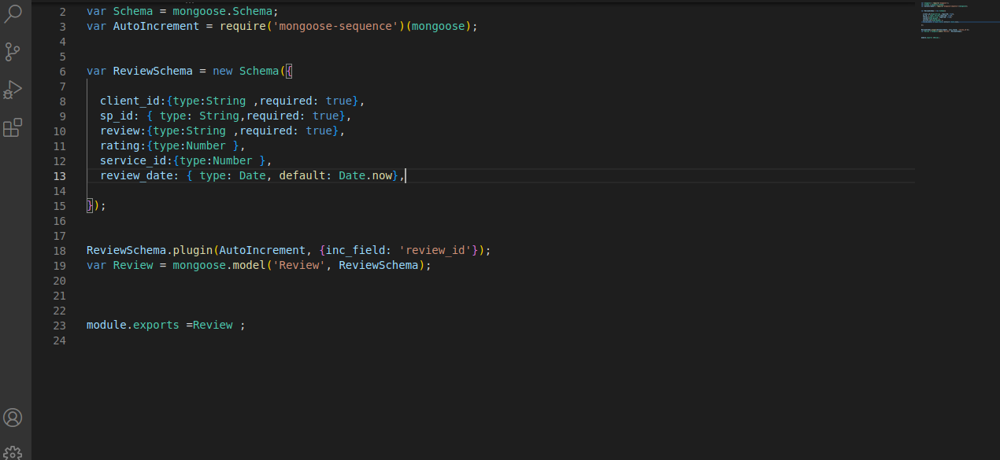
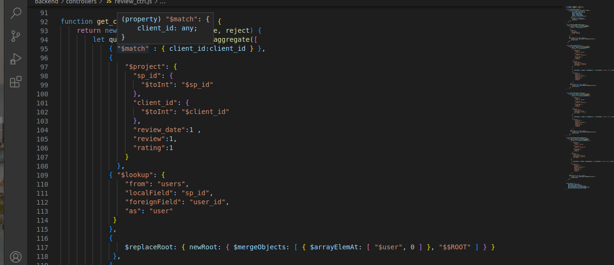
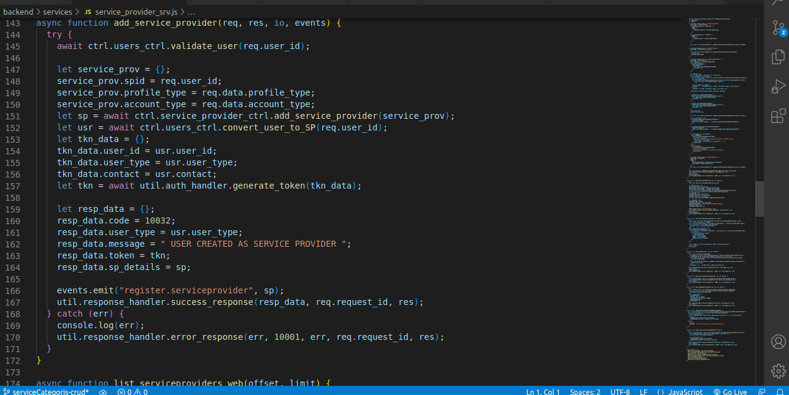

<h3> Client data model for holding the attributes of sign up </h3>

```backend/models/users_mdls.js(var usersSchema=new Schema)```

<p> It stores user signup credentials</p>
<p> It save user credentials for sing up and exports it to the database where is stored</p>




<h3> Client data model for holding the attributes of sign up</h3>

```backend/models/users_mdls.js(var usersSchema=new Schema)```

<p> It stores user signup credentials</p>
<p> It save user credentials for sing up and exports it to the database where is stored</p>


<h3>Client Authentication to check if the user has entered a valid username and password for login.</h3>

<h3>Client data models for holding the client attributes of login</h3>

```backend/models/users_mdls.js(var usersSchema=new Schema)```

<p> It stores client login credentials</p>
<p> It save user credentials for login and exports it to the database where is stored</p>


<h3>Client data model for holding the attributes of the client profile setup </h3>

<p> It stores client profile setup credentials</p>

<p> It save user credentials for profile setup and exports it to the database where is stored</p>


```backend/models/users_mdls.jsVar UsersSchema = new Schema)```



<h3>Client data model for holding the attributes of resetting the password</h3>

```backend/services/users_srv.js Async function reset_password)```

<p> It stores user reset password credentials</p> 

<p> It save user credentials for resetting password and exports it to the database where it is stored</p>




<h3> Send email for verifying client reset password.</h3>

```backend/interfaces/email.js(const sendEmail=async(to,subject,content,attachment)```


<h3>Data models for holding the attributes of the different services</h3>

```backend/models/services_mdls.js(Var ServicesSchema )```

<p> It stores the atributes of different services</p>

<p> It saves the attributes of the different services and exports them to the database where it is stored</p>


<h3>Data model for holding the attributes of the service category</h3>

```backend/models/service_category_mdls.js(var ServiceCategorySchema = new Schema)```


<p> It stores attributes of different service categories</p>

<p> It saves the attributes of the different service categories and exports them to the database where it is stored</p>



<h3>Data models for holding the attributes of the service sub-category </h3>

```backend/models/service_sub_category_mdls.js(var ServiceSubCategorySchema)```


<p> It stores the attributes of the diiferent service sub categories </p>

<p> It saves the attributes of the different service sub categories and exports them to the database where it is stored</p>


<h3>Data model for holding the credentials of the service provider.</h3>

```backend/models/service_provider_mdls.js(var ServiceProviderSchema = new Schema)```

<p> It stores the credintials of different service providers </p>

<p> It saves the credentials of different service providers and exports them to the database where it is stored</p>



<h3> data model for holding the data of the client  review</h3>
 
 ```backend/models/reviews_mdls.js(var ReviewSchema = new Schema)```

<p> It stores the data of the client review</p>

<p> It saves the data of the client reviews and exports them into the database where it is stored</p>

 

<h3>Data model for getting  the client  review</h3>

 ```backend/controllers/review_ctrl.js(var ReviewSchema = new Schema)```

<p> It stores the attributes for getting client reviews</p>

<p> It saves the attributes of getting client reviews and exports them into the database where it is stored</p>

  

<h3>Data model for holding the terms and condition attributes</h3>

 ```backend/models/terms_condition_mdls.js(Var  TncSchema=new Schema)```

<p> It stores the attributes for the terms and conditions</p>

<p> It saves the attributes of the terms and conditions and exports them into the database where it is stored</p>

   

<h3>Data model for holding the service provider registeration attributes</h3>

 ```backend/services/service_provider_srv.js(add_service_provider```

<p> It stores the credentials for service provider regestration</p>

<p> It saves the credentials of the service rpovider regestration and exports them into the database where is stored</p>

   

<h3>Verification to check if the service provider provider account  is already  existing.</h3>

 ```backend/services/service_provider_srv.js(add_service_provider```

<p> It stores the attributes for service provider verification account</p>

<p> It saves attributes of the service provider account verification and exports them in to the database where it is stored</p>

   

<h3>Data model for holding the attributes of the service provider profile information. .</h3>

 ```backend/services/service_provider_srv.js(add_service_provider```

<p> It stores the attributes for service provider profile information</p>

<p> It saves the attributes of the service provider profile information and exports them into the database where is stored</p>


   


