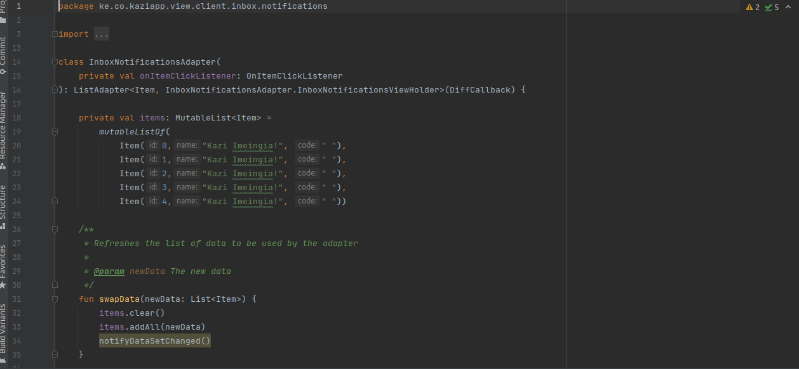
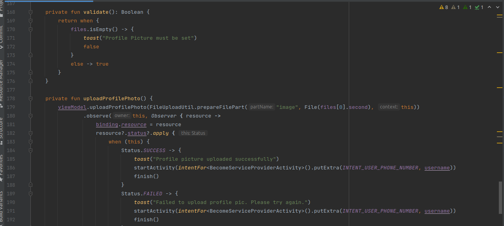
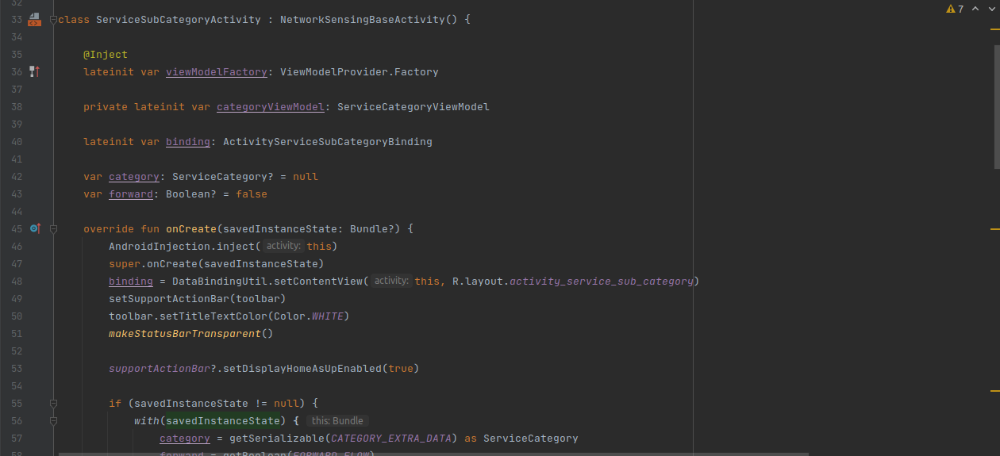
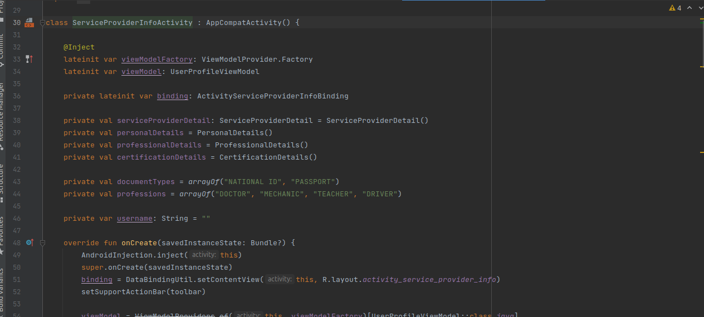

<h3> Client Sign up screen </h3>

```kazi/app/java/ke.co.kaziapp/ui/v1/register activity.kt(class RegisterActivity : NetworkSensingBaseActivity)```
<p> - It creates a new user and save the user details to the backend </p>

<p> - It verifies user before registering </p>

<p> - It validate the user entities to ensure it is in the right format </p>

<p> - It ensures the client agrees with the terms and condition of the app before registering</p>


 
<h3> Client Verification for verifying the new account</h3>

``` kazi/appjava/ke.co.kaziapp/ui/v1/GetOtpActivity.kt(class GetOtpActivity : NetworkSensingBaseActivity)```

<p> - It verifies the new acccount to ensure the credentials are valid before registering</p>

<p> - it ensures that the client credentials for the new account are valid </p>


<h3> Client Login screen</h3>

```kazi/app/java/ke.co.kaziapp/ui/v1/login activity.kt(class LoginActivity : NetworkSensingBaseActivity)```
<p> - It verifies to check if the client logs in with the account that is already in the system</p>

<p> - It authenticate the client loging in with the account that matches the one in the system</p>

<p> - It validate the client password to ensure that the client enters the correct password that matches the one that is already registered in the system </p>


<h3> Client Verification for verifying the existing account </h3>

``` kazi/app/java/ke.co.kaziapp/ui/v1/GetOtpActivity.kt(class GetOtpActivity : NetworkSensingBaseActivity)```

<p> - It verifies the phone number for sending the otp </p>

<p> - It verifies the otp to make sure that the otp send to the user is the valid otp</p>

<p> - It ensures that the otp entered by the user is the correct one</p>


<h3> Client set up profile screen</h3>

``` kazi/app/java/ke.co.kaziapp/ui/v1/profilesetting activity.kt(class ProfileSettingsActivity NetworkSensingBaseActivity)```

<p> - It creates a new user profile and saves the details to the backend </p>

<p> - It verifies the data for profile setting to ensure that the client enters the correct data with the correct format</p>

<p> - It converts the image-url into string </p>

<p> - It verifies the profile picture to ensure it meets the requirements and the client uploads the correct image </p>


<h3>Client Validation for validating if the client have entered the valid credentials of profile setup.</h3>

```kazi/app/java/ke.co.kaziapp/ui/v1/profilesetting activity.kt(private fun validate)```
<p> - It creates a new user profile and saves the details to the backend </p>

<p> - It verifies the data for profile setting to ensure that the client enters the correct data with the correct format</p>

<p> - It converts the image-url into string </p>

<p> - It verifies the profile picture to ensure it meets the requirements and the client uploads the correct image </p>


<h3>Notification screen to notify the client of the new services that are available in the application. </h3>

```kazi/app/java/ke.co.kaziapp/src/main/view/client/inbox/notifications/InboxNotificationsAdapter.kt```



<h3>Client reset password screen </h3>

```kazi/app/java/ke.co.kaziapp/ui/v1/forgot password Activity/private fun resetPassword```

<p> - It verifies to check if  the user has entered the correct credential for resseting password </p>

<p> - It validates the new password created  </p>


<h3>Explore service screen </h3>

```kazi/app/java/ke.co.kaziapp/ui/v1/servicelistActivity( class ServicesListActivity : NetworkSensingBaseActivity```

<p> - It  </p>


<h3>Validation to validate  if the user have entered the valid credentials.</h3>

```kazi/app/java/ke.co.kaziapp/ui/v1/profilesetting activity.kt( private fun validate)```



<h3> Explore Service category screen </h3>

```kazi/app/java/ke.co.kaziapp/ui/v1/service category Activity.kt(class ServiceSubCategoryActivity : NetworkSensingBaseActivity)```


<h3> Service sub-category screen</h3>

```kazi/app/java/ke.co.kaziapp/ui/v1/servicesubcategoryActivity,kt(class ServiceSubCategoryActivity : NetworkSensingBaseActivity)```

<p> - It creates a new  service sub-category and saves the details to the backend </p>

<p> - It verifies service sub-category details before saving</p>

<p> - It validate the service sub-category entities to ensure it is in the right format </p>



<h3>Service provider screen</h3>

```kazi/app/java/ke.co.kaziapp/ui/v1/serviceproviderinfoActivity,kt( class ServiceProviderInfoActivity : AppCompatActivity)```



<h3> Client review screen</h3>

```kazi/app/java/ke.co.kaziapp/ui/v1/review/ClientreviewFragment(class ClientReviewsFragment)```

<p> - It verifies client review details</p>

<p> - It validate the client review entities to ensure it is in the right format </p>


<h3>Terms and condition screen </h3>

```kazi/app/java/ke.co.kaziapp/ui/v1/terms and conditions Activity,kt( class TermAndConditionsActivity : AppCompatActivity)```


<h3>Chat screen </h3>

```kazi/app/java/ke.co.kaziapp/ui/v1/ChatsActivity.kt( class Terms And Conditions Activity : AppCompatActivity)```

<h3> Service provider Sign up screen </h3>

```kazi/app/java/ke.co.kaziapp/ui/v1/RegisterActivity.kt(private fun validate)```

<p> - It creates a new service provider and save the the details into the backend </p>

<p> - It verifies the service provider details before registering </p>

<p> - It validate the service provider entities to make sure it is in the right format </p>

<p> - It ensures service provider agrees with the terms and condition before registering </p>


<h3> Authentication  to check if the service provider has entered the correct credentials.</h3>

```kazi/app/java/ke.co.kaziapp/ui/v1/RegisterActivity.kt(private fun validate)```


<h3> Service provider set up profile screen</h3>

``` kazi/app/java/ke.co.kaziapp/ui/v1/profilesetting activity.kt(class ProfileSettingsActivity NetworkSensingBaseActivity)```

<p> - It creates a new service provider profile and saves the details into the backend </p>

 <p> - It verifies the data for profile setting to ensure that the service provider enters the correct data with the correct format</p>

<p> - It converts the image-url into string </p>

<p> - It verifies the profile picture to ensure it meets the requirements and the service provider  uploads the correct image </p>


